# StockFlow Core

A full-stack inventory management system built as the anchor project of this portfolio. It demonstrates end-to-end product delivery across three surfaces — a REST API, a web frontend, and a mobile app — all sharing the same business domain and authentication layer.

---

## Architecture

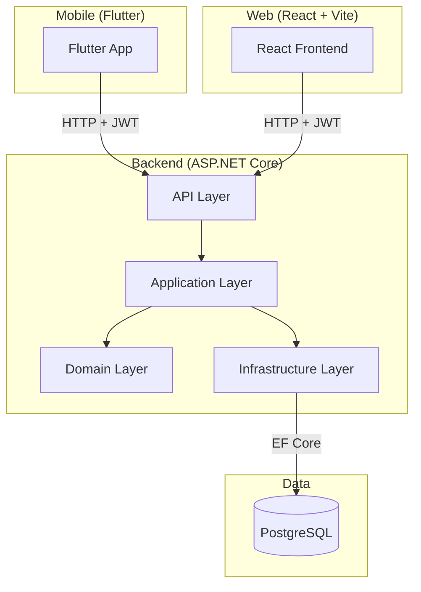

**Layered architecture** — Domain holds business rules with no external dependencies. Application orchestrates use cases. Infrastructure owns persistence. API exposes HTTP endpoints and handles auth.

---

## Tech Stack

| Layer | Technology |
|-------|-----------|
| API | ASP.NET Core 9, C# |
| Database | PostgreSQL + EF Core (code-first migrations) |
| Auth | JWT (register, login, protected endpoints) |
| Web | React 19, TypeScript, Vite |
| Mobile | Flutter 3, Dart |
| Tests | xUnit (unit tests for domain and application rules) |
| CI | GitHub Actions (build, test, lint) |
| API Docs | Swagger / OpenAPI with Bearer token support |

---

## Features

- user registration and login with JWT
- category management (create, edit, delete)
- product management (create, edit, activate, inactivate)
- stock entry and exit with business rule validation
- current stock balance per product
- full movement history per product
- web interface for all operational flows
- mobile app for field operators (balance lookup, movement registration)

---

## Screenshots

### Web Frontend

| Login | Operational Overview |
|-------|---------------------|
| 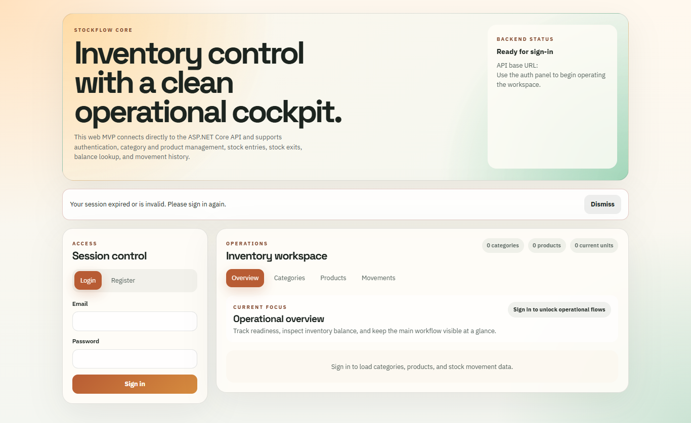 | 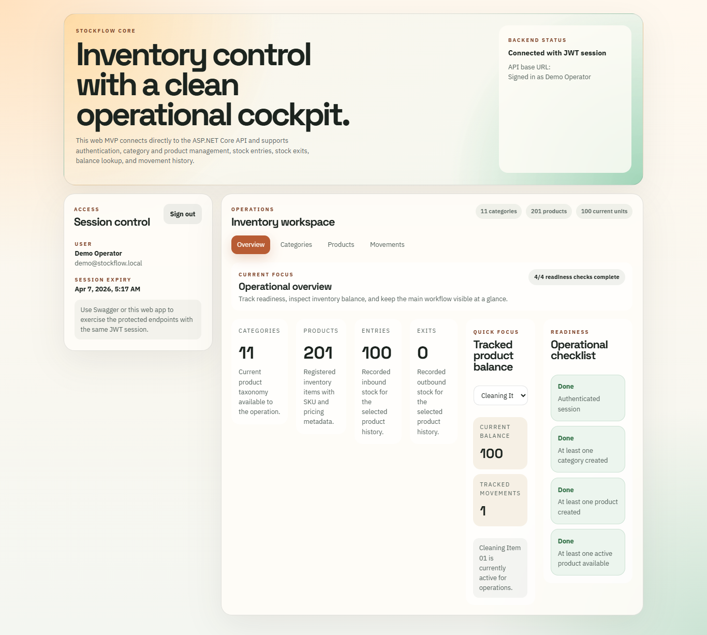 |

| Categories | Products |
|------------|---------|
| 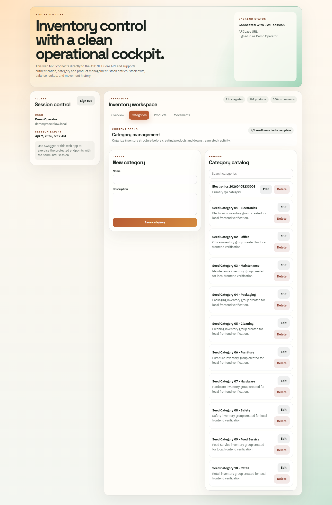 | 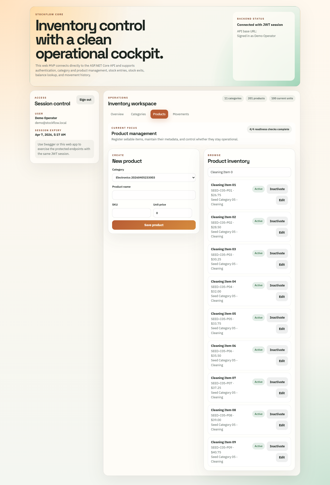 |

| Stock Movements |
|----------------|
| 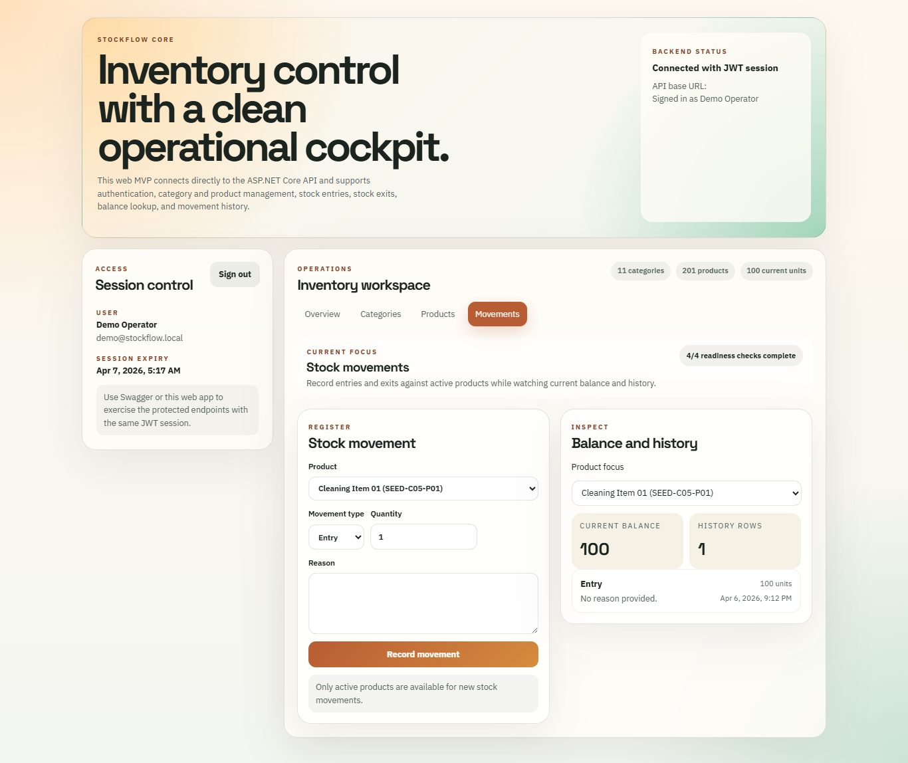 |

---

### Mobile App (Flutter)

| Login | Home | Products |
|-------|------|---------|
| 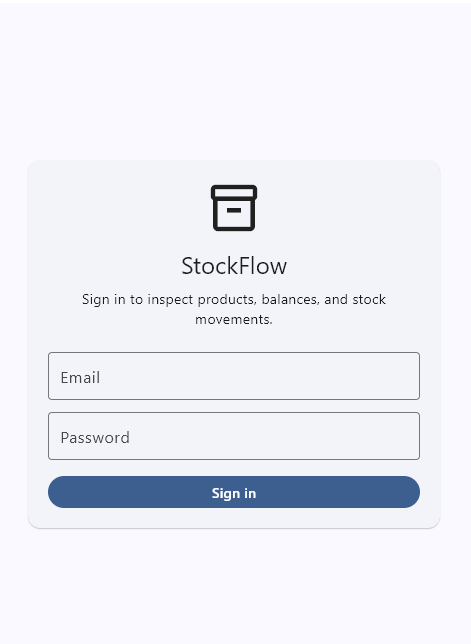 | 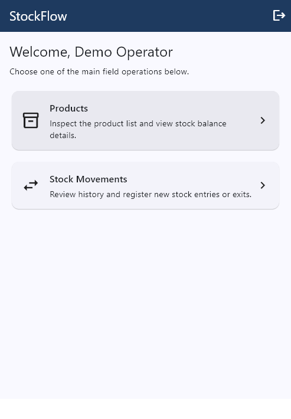 | 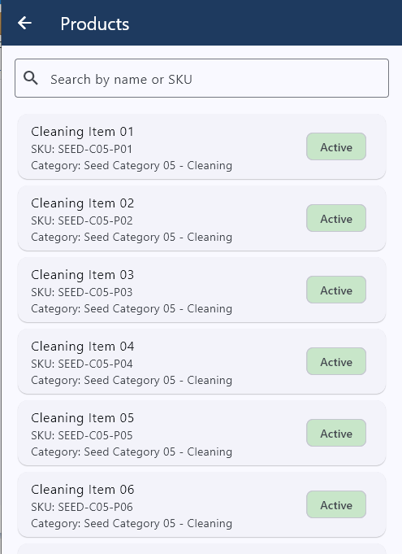 |

| Product Detail | New Movement | Movement History |
|---------------|-------------|-----------------|
| 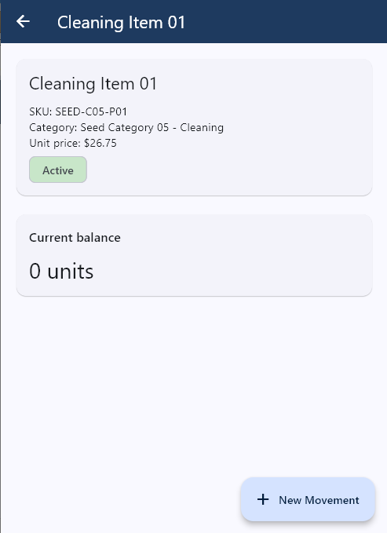 | 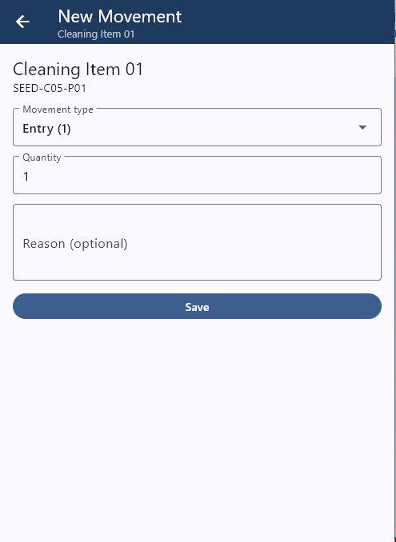 | 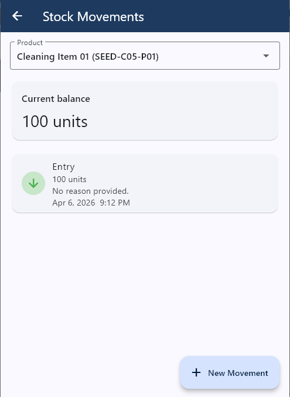 |

---

### API (Swagger)

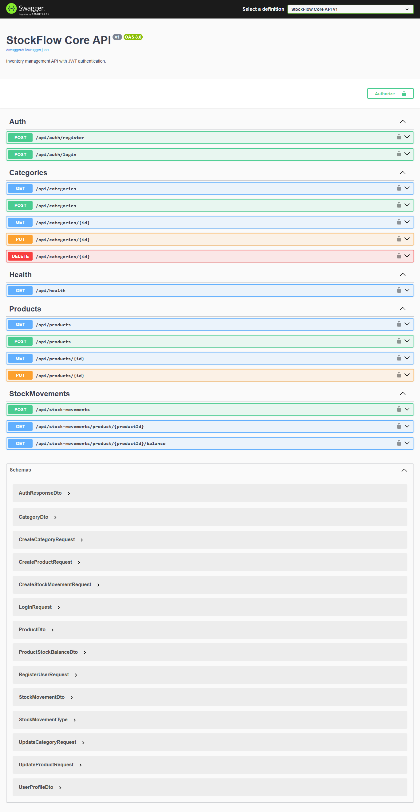

---

## Project Structure

```
StockFlow.Core/
  backend/
    src/
      StockFlow.Core.Api            # controllers, middleware, program entry
      StockFlow.Core.Application    # use cases, services, DTOs
      StockFlow.Core.Domain         # entities, business rules, enums
      StockFlow.Core.Infrastructure # EF Core, repositories, persistence
    tests/
      StockFlow.Core.UnitTests      # unit tests for domain and application
  frontend/
    src/
      api/        # typed API client modules
      components/ # UI components per section
      hooks/      # state management hooks
      types/      # shared TypeScript types
      utils/      # formatters
  mobile/
    stockflow_mobile/
      lib/
        core/     # API client, models, services, constants
        features/ # screens organized by feature
  docs/
    backend/      # local setup guide
    domain/       # domain model documentation
    planning/     # execution plan, scope, audit log
```

---

## Local Setup

### Prerequisites

- .NET 9 SDK
- PostgreSQL 16+
- Node.js 22+
- Flutter 3.x (for mobile only)

### Backend

```bash
# 1. create the database
psql -U postgres -c "CREATE DATABASE stockflow_core;"

# 2. run migrations
cd backend
dotnet ef database update \
  --project src/StockFlow.Core.Infrastructure \
  --startup-project src/StockFlow.Core.Api

# 3. (optional) seed demo data
cd src/StockFlow.Core.Api
dotnet run --seed-demo-data

# 4. start the API
dotnet run --urls "http://0.0.0.0:5174"
```

API available at `http://localhost:5174`
Swagger UI at `http://localhost:5174/swagger`

Demo credentials (after seed): `demo@stockflow.local` / `Password123!`

### Frontend

```bash
cd frontend
npm install
npm run dev
```

Frontend available at `http://localhost:5173`

### Mobile

```bash
cd mobile/stockflow_mobile
flutter pub get
flutter run -d windows   # desktop
flutter run -d chrome    # browser
flutter run              # connected device or emulator
```

The backend URL is configured in `lib/core/constants.dart`.

---

## CI

GitHub Actions runs on every push to `main` and on pull requests:

- backend: `dotnet restore` → `dotnet build` → `dotnet test`
- frontend: `npm ci` → `npm run lint` → `npm run build`

---

## Testing

Unit tests cover the core business rules:

```bash
cd backend
dotnet test
```

Test areas:
- stock balance calculation
- stock exit validation (insufficient balance)
- user registration and authentication rules
